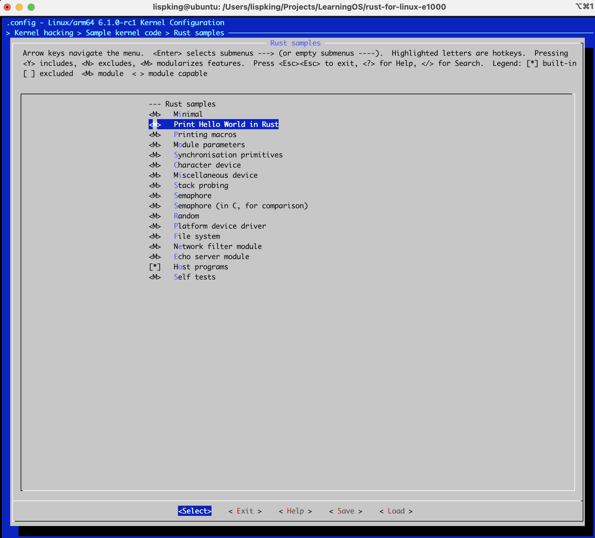
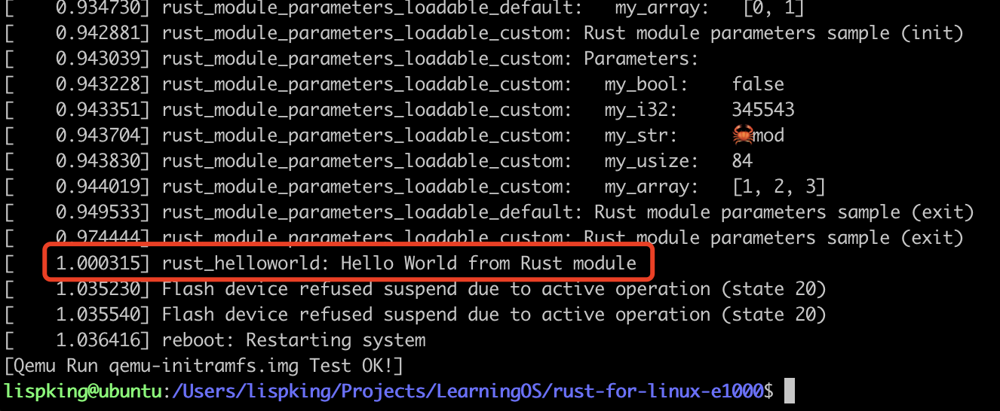

# Exercise 2

## 练习2: 自定义编写Rust内核驱动模块

We will only do in-tree compilation. In this part, we need to build a minimal kernel module

* 编写 `rust_helloworld` 模块

```shell
## 进入练习1所在源码目录
cd $HOME/linux

## 添加 RustHelloWorld 模块源码
cat <<EOF > samples/rust/rust_helloworld.rs
// SPDX-License-Identifier: GPL-2.0
//! Rust minimal sample.
      
use kernel::prelude::*;
      
module! {
  type: RustHelloWorld,
  name: "rust_helloworld",
  author: "whocare",
  description: "hello world module in rust",
  license: "GPL",
}
      
struct RustHelloWorld {}
      
impl kernel::Module for RustHelloWorld {
  fn init(_name: &'static CStr, _module: &'static ThisModule) -> Result<Self> {
      pr_info!("Hello World from Rust module");
      Ok(RustHelloWorld {})
  }
}
EOF
```

* 添加编译相关配置

```shell
## 在 samples/rust/Makefile 文件添加以下内容：
obj-$(CONFIG_SAMPLE_RUST_HELLOWORLD)        += rust_helloworld.o

## 在 samples/rust/Kconfig 文件添加以下内容：
config SAMPLE_RUST_HELLOWORLD
  tristate "Print Hello World in Rust"
  help
    This option builds the Rust HelloWorld module sample.
      
    To compile this as a module, choose M here:
    the module will be called rust_helloworld.
      
    If unsure, say N.

## 在练习1基础上，添加 rust_helloworld 模块配置
make ARCH=arm64 LLVM=1 O=build menuconfig
```



* 编译 `rust_helloworld` 模块

```shell
## 将 rust_helloworld 模块编译，编译成功后，会生成 build/samples/rust/rust_helloworld.ko 文件
cd build && time make ARCH=arm64 LLVM=1 -j8
```

* 修改 `qemu-init.sh` 脚本，增加 `rust_helloworld` 模块

```shell
busybox insmod rust_helloworld.ko
busybox  rmmod rust_helloworld.ko
```

* 修改镜像描述文件 `qemu-initramfs.desc`，增加 `rust_helloworld` 模块

```shell
file    /rust_helloworld.ko         samples/rust/rust_helloworld.ko         0755 0 0
```

* 启动 `qemu` 验证

```shell
qemu-system-aarch64 \
  -kernel build/arch/arm64/boot/Image.gz \
  -initrd qemu-initramfs.img \
  -M virt \
  -cpu cortex-a72 \
  -smp 2 \
  -nographic \
  -vga none \
  -no-reboot \
  -append ' \
    rust_module_parameters_builtin_custom.my_bool=n \
    rust_module_parameters_builtin_custom.my_i32=345543 \
    rust_module_parameters_builtin_custom.my_str=🦀mod \
    rust_module_parameters_builtin_custom.my_usize=84 \
    rust_module_parameters_builtin_custom.my_array=1,2,3 \
  ' \
  | sed 's:\r$::'
```

* 验证结果显示如下面红色框，则表示`rust_helloworld` 模块加载成功。



* 代码已上传至：https://github.com/lispking/rust-for-linux-e1000/commit/fe8497d45e5cf719a4c1816c4183c80a55816899
