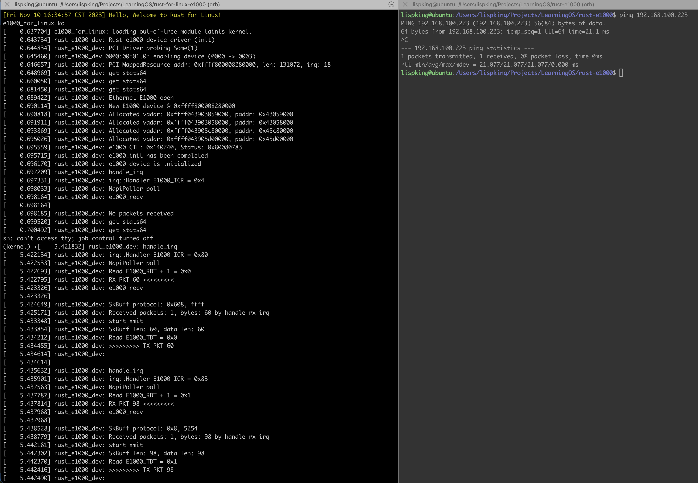

# 基于Qemu模拟器上的e1000网卡驱动框架，填充驱动初始化函数
获取e1000-driver代码 https://github.com/yuoo655/e1000-driver 
完成Exercise3 Checkpoint 1-5

# 自定义一个linux内核函数, 并在rust模块中调用它.

# step1
在linux include目录下创建一个头文件xx.h, 在里面写好自定义的一个函数, 打印一行log出来. 

# step2
在linux rust/bindings/bindings_helper.h中把step1中的头文件引用进来. 在rust/helpers.c中参考其中已有例子,生成rust_helper_为前缀的函数.

# step3
在Rust网卡驱动模块中模块中引入kernel::bindings::*; 通过bindings::函数名方式调用.


### 优雅的分界线

1. 由于在练习1里面是用的.github/workflow里的脚本生成的镜像，那个镜像的问题是不会停留在内核里，所以需要重新做一个

```shell
cd busybox-1.36.1

# 上一次练习没有执行这一步
make install
```

2. 由于实验用的是 `fujita/linux` 源码，需要将自带的 `e1000` 驱动先去掉，再重新编译内核

3. 启动脚本 `qemu-aarch64-test.sh` 改成下面：

```shell
#!/bin/bash

BUSYBOX=../busybox-1.36.1
INITRD=${PWD}/initramfs.cpio.gz
BUSYBOX_INSTALL_DIR=$BUSYBOX/_install
MODULE_DIR=/lib/modules

cat <<EOF > $BUSYBOX_INSTALL_DIR/init
#!/bin/busybox sh

/bin/busybox mkdir -p /proc && /bin/busybox mount -t proc none /proc

/bin/busybox echo -e "\033[33m[$(date)] Hello, Welcome to Rust for Linux! \033[0m"

/bin/busybox ls $MODULE_DIR
/bin/busybox insmod $MODULE_DIR/e1000_for_linux.ko

/bin/busybox ip addr add 127.0.0.1/32 dev lo
/bin/busybox ip link set lo up

/bin/busybox ip addr add 192.168.100.223/24 dev eth0
/bin/busybox ip link set eth0 up

export 'PS1=(kernel) >'
/bin/busybox sh
EOF

# 参考这里: https://www.jianshu.com/p/9b68e9ea5849
# Set host-only network
if [ "$1" == "init-host-only" ]; then
  sudo ip link add br0 type bridge
  sudo ip addr add 192.168.100.50/24 brd 192.168.100.255 dev br0
  sudo ip tuntap add mode tap user $(whoami)
  ip tuntap show
  sudo ip link set tap0 master br0
  sudo ip link set dev br0 up
  sudo ip link set dev tap0 up
fi

chmod +x $BUSYBOX_INSTALL_DIR/init

mkdir -p $BUSYBOX_INSTALL_DIR/$MODULE_DIR/

## 网卡驱动 ko 文件
cp ../rust-e1000-driver/src/e1000_for_linux.ko $BUSYBOX_INSTALL_DIR/$MODULE_DIR/

cd $BUSYBOX_INSTALL_DIR && find . -print0 | cpio --null -ov --format=newc | gzip -9 > ${INITRD} && cd -

qemu-system-aarch64 \
  -kernel ./build/arch/arm64/boot/Image.gz \
  -initrd ${INITRD} \
  -M virt \
  -cpu cortex-a72 \
  -smp 2 \
  -m 128M \
  -nographic \
  -netdev tap,ifname=tap0,id=tap0,script=no,downscript=no -device e1000,netdev=tap0 \
  -append 'init=/init console=ttyAMA0'
```

4. 左边窗口执行 `./qemu-aarch64-test.sh`，网卡驱动和 `ip` 地址在 `init` 脚本里已实现自动加载，待 `qemu` 启动后，在右边窗口执行 `ping` 命令，运行成功，结果将如下所示：


