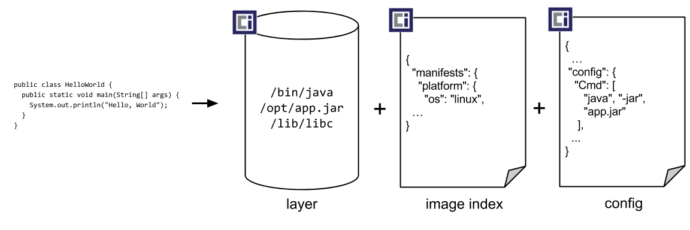
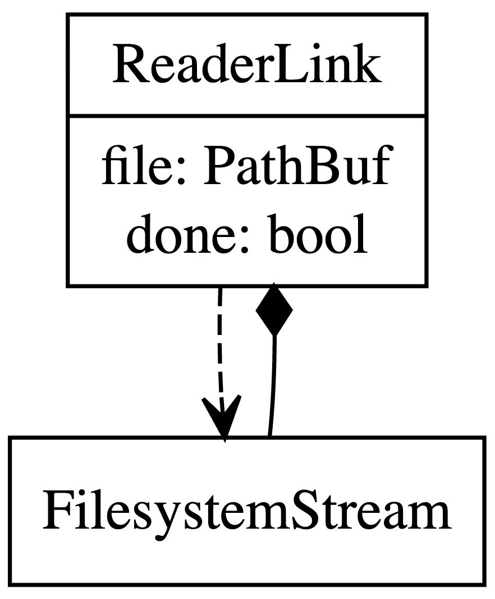

# PuzzleFS - 下一代 Linux 容器文件系统之源码分析报告

PuzzleFS 项目地址：https://github.com/project-machine/puzzlefs

> PuzzleFS 号称是`下一代 Linux 容器文件系统`，采用 Rust 语言编写，具有`快速镜像构建`、`直接挂载支持`、`内存安全保证`等功能。

---

## PuzzleFS 项目介绍

思科开发者 `Ariel Miculas` 在[内核邮件列表](https://lore.kernel.org/rust-for-linux/20230609063118.24852-1-amiculas@cisco.com/)中，发布了用 Rust 写的 PuzzleFS 文件系统驱动，以征求其他开发者的意见，目前这一驱动程序处于“概念验证”阶段。

PuzzleFS 是一种`只读`的文件系统，与 `Open Container Initiative (OCI) v2 image specification` 的设计目标相符，它使用内容定义进行分块，并且使用内容寻址的数据存储，旨在解决现有 OCI 格式的限制。

> OCI 镜像规范的第一个版本存在许多问题，这些问题的根源都是来自依赖 tar 存档来保存文件系统中的层，事实上 `tar 不适合解决容器文件系统问题`。

PuzzleFS 旨在解决 tar 的问题。文件系统镜像本身由一组放置在底层文件系统上的文件组成。与 `OCI 镜像格式一样`，存在一个顶级 `index.json` 文件，其中包含一组标签，每个标签代表某一个版本的文件系统，并指向一个清单文件（`manifest file`）。清单文件又指向镜像配置和存储在实际镜像层中的数据。其他所有内容都存储为 `blobs/sha256` 目录中的一组 `blob`。

文件系统中的大多数数据都被分成可变大小的块（`chunk`），以内容的 `SHA256` 哈希作为文件名来存储为 `blob`。这个分块动作本身是使用 `FastCDC 算法`进行的，该算法查找 "切割点（`cut points`）"，把数据流分为不同大小的 `blob`。任何一个特定的流（例如文件的内容）都可以分成`五个`或`五十个块`，这取决于如何确定这些切割点；然后，每个块都以不同的 `blob` 方式落在 `blobs/sha256` 下，并将其哈希添加到清单中。

---

## 环境准备

### 实验环境信息

* CPU: Apple M1
* 宿主机OS：macOS Sonoma 14.1.1
* 虚拟机：使用 OrbStack 安装 ubuntu 23.10，选用 OrbStack 理由看 这里：https://docs.orbstack.dev/

### Ubuntu 环境准备

* 设置 Rustup 镜像， 修改配置 ~/.zshrc or ~/.bashrc

```bash
export RUSTUP_DIST_SERVER="https://rsproxy.cn"
export RUSTUP_UPDATE_ROOT="https://rsproxy.cn/rustup"
```

* 安装 Rust（请先完成步骤一的环境变量导入并 source rc 文件或重启终端生效）

```bash
curl --proto '=https' --tlsv1.2 -sSf https://rsproxy.cn/rustup-init.sh | sh
```

* 设置 crates.io 镜像， 修改配置 ~/.cargo/config，已支持git协议和sparse协议，>=1.68 版本建议使用 sparse-index，速度更快。

```bash
cat <<EOF > ~/.cargo/config
[source.crates-io]
replace-with = 'rsproxy-sparse'
[source.rsproxy]
registry = "https://rsproxy.cn/crates.io-index"
[source.rsproxy-sparse]
registry = "sparse+https://rsproxy.cn/index/"
[registries.rsproxy]
index = "https://rsproxy.cn/crates.io-index"
[net]
git-fetch-with-cli = true
EOF
```

* 修改 Ubuntu 源，加速依赖包更新速度

```bash
sudo cp /etc/apt/sources.list /etc/apt/sources.list.bak
sudo sed -i 's/ports.ubuntu.com/mirrors.ustc.edu.cn/' /etc/apt/sources.list
```

* 安装 Linux 内核相关依赖包

```bash
## first Update
sudo apt update

## Install dependency packages
sudo apt -y install \
  binutils build-essential libtool texinfo \
  gzip zip unzip patchutils curl git \
  make cmake ninja-build automake bison flex gperf \
  grep sed gawk bc \
  zlib1g-dev libexpat1-dev libmpc-dev \
  libglib2.0-dev libfdt-dev libpixman-1-dev libelf-dev libssl-dev

## Install the LLVM
sudo apt -y install clang-format clang-tidy clang-tools clang clangd libc++-dev libc++1 libc++abi-dev libc++abi1 libclang-dev libclang1 liblldb-dev libllvm-ocaml-dev libomp-dev libomp5 lld lldb llvm-dev llvm-runtime llvm python3-clang
```

* 安装 PuzzleFS 需要用到的工具

```bash
sudo apt install -y capnproto skopeo umoci tree jq
```

---

## 编译和挂载 PuzzleFS 镜像

### 测试文件准备

```bash
# 1. 创建相关测试目录
mkdir -p /tmp/example-rootfs/algorithms /tmp/mounted-image

# 2. 创建测试文件
echo "Binary Search" > /tmp/example-rootfs/algorithms/binary-search.txt
echo "test" > /tmp/example-rootfs/algorithms/test.txt
echo "lorem ipsum" > /tmp/example-rootfs/lorem_ipsum.txt
tree /tmp/example-rootfs
```

### 编译 PuzzleFS 源码

```bash
cargo build --release 
```

### 构建 PuzzleFS 镜像

```bash
target/release/puzzlefs build -c /tmp/example-rootfs /tmp/puzzlefs-image puzzlefs_example
```

运行成功会产生以下信息，`build` 命令内部实际通过 Linux 内核工具模块 `fs-verity` 实现。

```bash
puzzlefs image manifest digest: 743b08e98105e637c47adb80a17ba21ed12eb31523a056a0970ff687551904d7
```

### 挂载 PuzzleFS 镜像

* 通过 PuzzleFS 工具挂载到系统

```bash
target/release/puzzlefs mount /tmp/puzzlefs-image puzzlefs_example /tmp/mounted-image
```

* 验证挂载结果

```bash
# 1. 验证挂载结果
mount|grep fuse

# 若显示结果出现 /dev/fuse on /tmp/mounted-image，则代表镜像挂载成功
/dev/fuse on /tmp/mounted-image type fuse (rw,nosuid,nodev,relatime,user_id=501,group_id=501)

# 2. 验证挂载目录情况是否与 /tmp/example-rootfs 内容一致
tree /tmp/mounted-image

# 若显示结果如下，则代表文件挂载成功
/tmp/mounted-image
├── algorithms
│   ├── binary-search.txt
│   └── test.txt
└── lorem_ipsum.txt

# 3. 查看 PuzzleFS 文件组织结构
tree /tmp/puzzlefs-image/

# 显示内容如文章介绍所述
/tmp/puzzlefs-image/
├── blobs
│   └── sha256
│       ├── 04718eb872552abfdf44d563aa09bdf89343950a364d9ff555fc6e3657d383b4
│       ├── 73ee73b991e91697ec02c990de8401d7c316d3392ec394be7162195dc783c9b5
│       └── e10090d2c24f6a299ad6fee3e6f345a784918bc89530a1329c92c40de71a9c47
├── index.json
└── oci-layout

# 4. 查看 /tmp/puzzlefs-image/index.json 内容
cat /tmp/puzzlefs-image/index.json | jq .

# manifests 里的 digest 确实指示到 /tmp/puzzlefs-image/blobs/sha256 下
{
  "schemaVersion": -1,
  "manifests": [
    {
      "digest": "sha256:04718eb872552abfdf44d563aa09bdf89343950a364d9ff555fc6e3657d383b4",
      "size": 272,
      "media_type": "application/vnd.puzzlefs.image.rootfs.v1",
      "annotations": {
        "org.opencontainers.image.ref.name": "puzzlefs_example"
      }
    }
  ],
  "annotations": {}
}

# 5. 复制内容验证文件
mkdir -p ~/puzzlefs/format
cp -f puzzlefs-lib/src/format/*.capnp ~/puzzlefs/format

# 6. 验证 PuzzleFS 文件系统 metadata 内容，注意 Rootfs 文件在 /tmp/puzzlefs-image/index.json 的 digest 字段已提供
capnp convert binary:json ~/puzzlefs/format/manifest.capnp Rootfs < /tmp/puzzlefs-image/blobs/sha256/04718eb872552abfdf44d563aa09bdf89343950a364d9ff555fc6e3657d383b4

# 这里可以看到文件的压缩开发、偏移以及文件验证信息等元数据均记录在此文件
{ "metadatas": [{ "digest": [115, 238, 115, 185, 145, 233, 22, 151, 236, 2, 201, 144, 222, 132, 1, 215, 195, 22, 211, 57, 46, 195, 148, 190, 113, 98, 25, 93, 199, 131, 201, 181],
    "offset": "0",
    "compressed": false }],
  "fsVerityData": [
    { "digest": [115, 238, 115, 185, 145, 233, 22, 151, 236, 2, 201, 144, 222, 132, 1, 215, 195, 22, 211, 57, 46, 195, 148, 190, 113, 98, 25, 93, 199, 131, 201, 181],
      "verity": [175, 40, 167, 26, 25, 10, 180, 65, 203, 152, 77, 163, 62, 196, 210, 184, 253, 43, 13, 128, 130, 115, 124, 42, 166, 42, 113, 75, 36, 144, 91, 6] },
    { "digest": [225, 0, 144, 210, 194, 79, 106, 41, 154, 214, 254, 227, 230, 243, 69, 167, 132, 145, 139, 200, 149, 48, 161, 50, 156, 146, 196, 13, 231, 26, 156, 71],
      "verity": [224, 250, 182, 10, 67, 174, 109, 47, 213, 23, 121, 57, 246, 130, 220, 70, 235, 42, 198, 50, 201, 130, 116, 91, 120, 12, 232, 61, 237, 227, 113, 94] } ],
  "manifestVersion": "2" }

# 7. 验证 PuzzleFS 文件系统 inode 内容
capnp convert binary:json ~/puzzlefs/format/metadata.capnp InodeVector < /tmp/puzzlefs-image/blobs/sha256/73ee73b991e91697ec02c990de8401d7c316d3392ec394be7162195dc783c9b5

# 可以看到日常看到的 ls -lat 命令查看的文件 dir、file 及对应的归属用户和权限都保存在这个文件里
{"inodes": [
  { "ino": "1",
    "mode": {"dir": {
      "entries": [
        { "ino": "2",
          "name": [97, 108, 103, 111, 114, 105, 116, 104, 109, 115] },
        { "ino": "3",
          "name": [108, 111, 114, 101, 109, 95, 105, 112, 115, 117, 109, 46, 116, 120, 116] } ],
      "lookBelow": false }},
    "uid": 501,
    "gid": 501,
    "permissions": 493 },
  { "ino": "2",
    "mode": {"dir": {
      "entries": [
        { "ino": "4",
          "name": [98, 105, 110, 97, 114, 121, 45, 115, 101, 97, 114, 99, 104, 46, 116, 120, 116] },
        {"ino": "5", "name": [116, 101, 115, 116, 46, 116, 120, 116]} ],
      "lookBelow": false }},
    "uid": 501,
    "gid": 501,
    "permissions": 493 },
  { "ino": "3",
    "mode": {"file": [{ "blob": {
        "digest": [225, 0, 144, 210, 194, 79, 106, 41, 154, 214, 254, 227, 230, 243, 69, 167, 132, 145, 139, 200, 149, 48, 161, 50, 156, 146, 196, 13, 231, 26, 156, 71],
        "offset": "0",
        "compressed": false },
      "len": "12" }]},
    "uid": 501,
    "gid": 501,
    "permissions": 420 },
  { "ino": "4",
    "mode": {"file": [{ "blob": {
        "digest": [225, 0, 144, 210, 194, 79, 106, 41, 154, 214, 254, 227, 230, 243, 69, 167, 132, 145, 139, 200, 149, 48, 161, 50, 156, 146, 196, 13, 231, 26, 156, 71],
        "offset": "12",
        "compressed": false },
      "len": "14" }]},
    "uid": 501,
    "gid": 501,
    "permissions": 420 },
  { "ino": "5",
    "mode": {"file": [{ "blob": {
        "digest": [225, 0, 144, 210, 194, 79, 106, 41, 154, 214, 254, 227, 230, 243, 69, 167, 132, 145, 139, 200, 149, 48, 161, 50, 156, 146, 196, 13, 231, 26, 156, 71],
        "offset": "26",
        "compressed": false },
      "len": "5" }]},
    "uid": 501,
    "gid": 501,
    "permissions": 420 } ]}
```

> 至此，PuzzleFS 镜像则准备完成，接下来，就可以开始从源码级别解刨 PuzzleFS 实现。

---

## 解刨前，需了解的知识

### [Image Format Specification](https://github.com/opencontainers/image-spec/blob/main/spec.md)

OCI manifest主要由一个或多个文件列表（组成一个完整的可运行的文件系统）、索引和配置等元数据组成。其中，配置文件包含应用参数、环境变量等信息。索引文件主要是文件清单列表描述，不同平台可能会所有差异。



OCI 镜像构建完成后，可通过名称方式发现和下载镜像，以及通过哈希方式进行验证，通过签名进行信任，并解压到 OCI 运行时中。


OCI 规范主要包括下面这些组件：
* Image Manifest - 有关容器镜像文件清单说明
* Image Index - 有关 Manifest 索引列表说明
* Image Layout - 有关镜像中的文件系统布局说明
* Filesystem Layer - 有关容器文件系统的变化说明
* Image Configuration - 有关镜像的配置说明
* Conversion - 有关转换如何发生的说明
* Artifacts Guidance - 除 OCI 镜像之外的打包规范说明
* Descriptor - 有关类型、元数据和内容地址等的说明

---

## PuzzleFS 源码分析

该工程主要包含`puzzlefs-lib`库和`exe`可执行两部分：

* `puzzlefs-lib`：PuzzleFS 库的实现
  - `format`：用于 PuzzleFS 格式的序列化和反序列化
  - `builder`：用于构建 PuzzleFS 镜像
  - `extractor`：用于解压 PuzzleFS 镜像
  - `reader`： 用于将 PuzzleFS 镜像挂载到 `FUSE`（文件系统）的模块。
* `exe/`：可执行文件封装主要是对一些命令和库进行组合，将其整合在一起。这个封装没有什么特别需要解读的地方，因为它只是简单地将相关功能集成在一起，方便用户使用。

---

### PuzzleFS 格式

PuzzleFS 主要由两部分组成：一个用于存储 inode 信息的元数据格式，以及由各种分块算法定义的实际文件系统数据块。其中，所有枚举值均编码为 u32；所有编码均为小端。

所有 PuzzleFS 块均由以下结构体封装：

```rust
enum hash {
  sha256,
}

typedef hash_value byte[32] // 对于 sha256

enum blob_type {
  root,
  metadata,
  file,
}

type puzzlefs_blob {
  enum hash;
  u64 references_len;
  hash_value references[];
  blob_type type;
  //  followed by the actual blob
}
```

> 下面通过一张 UML 图来解读 Puzzle 文件系统格式里相关组件的关系，源码文件位于 `format/types.rs` 


#### 根文件系统（Rootfs）的结构体定义

```rust
pub struct Rootfs {
    pub metadatas: Vec<BlobRef>,
    pub fs_verity_data: VerityData,
    pub manifest_version: u64,
}
```

> 用于描述一个 Rootfs 实例，其中包含了文件系统的元数据、完整性数据和清单版本号。这有助于系统和应用程序正确地处理和验证根文件系统的内容。

结构体包含以下成员：

1. `metadatas`：一个`Vec<BlobRef>`类型的成员，表示根文件系统的元数据。`BlobRef`可能是一个指向文件系统元数据的引用或指针。
2. `fs_verity_data`：一个`VerityData`类型的成员，表示文件系统的完整性数据。`VerityData`可能是一个用于验证文件系统数据完整性的结构体或类。
3. `manifest_version`：一个`u64`类型的成员，表示清单（manifest）的版本。这个版本号用于识别和区分不同的清单版本。


#### Blob 引用（BlobRef）的结构体定义

```rust
pub struct BlobRef {
    pub digest: [u8; SHA256_BLOCK_SIZE],
    pub offset: u64,
    pub compressed: bool,
}
```

> 用于文件系统中引用和标识 BLOB 数据。通过存储 BLOB 的哈希值、偏移量和压缩状态，这个结构体为文件系统的管理和操作提供了有关 BLOB 信息的基本概述。

结构体包含以下成员：

1. `digest`：`[u8; SHA256_BLOCK_SIZE]`类型，用于存储 BLOB 的哈希值。SHA256 是一种加密哈希算法，用于生成一个固定长度的哈希值。这个字节数组的长度为 SHA256 块大小，通常为 64 字节。
2. `offset`：`u64` 类型，表示 BLOB 在文件系统中的偏移量。这个偏移量用于定位 BLOB 在文件系统中的位置。
3. `compressed`：`bool` 类型，表示 BLOB 是否已压缩。如果为 `true`，则表示 BLOB 已压缩；如果为 `false`，则表示 BLOB 未压缩。

#### inode（节点）的结构体定义

```rust
pub struct Inode {
    pub ino: Ino,
    pub mode: InodeMode,
    pub uid: u32,
    pub gid: u32,
    pub permissions: u16,
    pub additional: Option<InodeAdditional>,
}
```

> 用于表示文件系统中的 inode，包含了识别和描述 inode 所需的基本信息。这有助于管理和操作文件系统中的文件和目录。

结构体包含以下成员：
1. `ino`：`Ino` 类型，表示 inode 的唯一标识符。inode 是文件系统中的一个基本概念，用于标识文件和目录。
2. `mode`：`InodeMode` 类型，表示 inode 的模式。`InodeMode` 可能是一个枚举类型，用于表示 inode 是文件还是目录，以及文件或目录的权限设置。
3. `uid`：`u32` 类型，表示 inode 所属的用户 ID。用户 ID 用于识别文件或目录的所有者。
4. `gid`：`u32` 类型，表示 inode 所属的组 ID。组 ID 用于识别文件或目录的所有者所属的组。
5. `permissions`：`u16` 类型，表示 inode 的权限。这些权限通常包括读、写和执行权限，用于控制用户和组对文件或目录的访问。
6. `additional`：`Option<InodeAdditional>` 类型，表示额外的 inode 信息。`InodeAdditional` 可能是一个包含更多详细信息的结构体或类。这个选项值为 `None` 时，表示没有额外的 inode 信息。


#### 元数据 BLOB（MetadataBlob）的结构体定义

```rust
pub struct MetadataBlob {
    reader: message::TypedReader<
        ::capnp::serialize::BufferSegments<Mmap>,
        crate::metadata_capnp::inode_vector::Owned,
    >,
}
```

> 用于表示一个元数据 BLOB，包含了读取和解析元数据所需的信息。这个结构体通常用于处理和分析文件系统中的元数据，以便更好地管理和操作文件。

结构体只有一个成员 `reader`：

这是一个 `message::TypedReader` 类型，用于读取和解析元数据 BLOB。`TypedReader` 是 `Cap'n Proto` 序列化库中的一个类型，用于读取和处理特定类型的数据。

`::capnp::serialize::BufferSegments<Mmap>` 是一个泛型类型，表示用于存储元数据的内存映射（`Mmap`）缓冲区。`Mmap` 是一种内存映射文件的技术，可以将文件内容映射到内存中，以便更快地访问和处理文件数据。

`crate::metadata_capnp::inode_vector::Owned` 是一个泛型类型，表示元数据 BLOB 中的 inode 向量。inode 向量可能是一个包含 inode 结构体的列表或数组，用于存储文件系统中的元数据。

---

### PuzzleFS 镜像构建

> 用于处理文件系统、压缩、加密或构建的工具或库。它提供了一些方法来操作文件系统、处理压缩、进行测试，并且与文件系统的可复现性或安全性有关。

#### 核心结构体定义

> 文件位于 `puzzlefs-lib/src/builder/filesystem.rs`

```rust
struct ReaderLink {
    file: PathBuf,
    done: bool,
}

/// A structure used to chain multiple readers, similar to
/// [chain](https://doc.rust-lang.org/std/io/trait.Read.html#method.chain)
/// and [multi_reader](https://docs.rs/multi_reader/latest/multi_reader/)
pub struct FilesystemStream {
    reader_chain: Vec<ReaderLink>,
    current_reader: Option<std::fs::File>,
}
```

该部分主要由两个结构体：`ReaderLink` 和 `FilesystemStream` 组成。

1. `ReaderLink` 结构体包含两个字段：
  - `file`：一个 `PathBuf` 类型的字段，表示文件的路径。
  - `done`：一个 `bool` 类型的字段，表示读取操作是否完成。

2. `FilesystemStream` 结构体用于链接多个 `Reader`，类似于 `std::io::Read` trait 的 `chain` 方法和 `multi_reader` 库，该做法的目的是方便按顺序读取多个文件。它包含两个字段：
  - `reader_chain`：一个 `Vec<ReaderLink>` 类型的字段，用于存储多个 `ReaderLink`，实现类似于链式文件读取的操作，例如，在读取一个文件之后自动切换到下一个文件。这种设计可以方便地实现流水线式的文件处理任务。
  - `current_reader`：一个 `Option<std::fs::File>` 类型的字段，表示当前正在使用的`reader`。

3. 两个结构体关系如下图所述：




#### 核心函数作用解读

> 文件位于 `puzzlefs-lib/src/builder.rs`

* `walker`: 用于遍历文件系统或目录结构。
* `add_entry`, `serialize_manifest`, `serialize_metadata`: 与将文件系统或目录结构的信息添加到某个数据结构或序列化有关。
* `process_chunks<C>`, `build_delta<C>`: 与处理文件或数据块的压缩相关，其中， `C` 代表某种压缩算法。
* `lookup_existing`: 用于查找或查询文件系统中的现有文件或目录。
* `build_initial_rootfs<C>`, `add_rootfs_delta<C>`: 与构建或修改文件系统根目录有关。
* `enable_fs_verity`: 用于启用文件系统 verity 相关的功能。
* `build_test_fs`, `test_fs_generation`, `test_delta_generation`: 与测试文件系统或其生成有关。
* `do_vecs_match<T>`: 用于比较两个序列或向量是否相等的。
* `get_image_blobs`: 用于获取镜像或数据块的。
* `same_dir_reproducible`, `same_dir_contents_reproducible`: 与检查目录或文件内容的可复现性有关。
* `test_reproducibility`: 用于测试或验证文件系统的可复现性。
* `build_dummy_fs`: 用于构建虚拟的文件系统。

---

### PuzzleFS 镜像解压

> 用于从容器或镜像中提取文件系统的工具或库。它提供了一些方法来处理文件和目录的创建、所有权和权限。

> 文件位于 `puzzlefs-lib/src/extractor.rs`

* `runs_privileged`: 用于检查当前运行是否具有 root 权限。
* `PuzzleFS`, `WalkPuzzleFS``: 用于处理文件系统的类或结构体。
* `makedev`, `mknod`, `Mode`, `SFlag`: 与文件系统或设备创建有关的函数或常量。
* `chown`, `mkfifo`, `symlinkat`, `Gid`, `Uid`: 与文件系统所有权、符号链接或 FIFO 管道创建有关的函数或常量。
* `HashMap`, `OsStr`, `Path`, `PathBuf`: 与文件系统路径或数据结构有关的类型。
* `fs`, `io`: 与文件系统操作或输入/输出操作有关的模块。

---

### PuzzleFS 镜像挂载

> 用于实现一个基于 FUSE 的文件系统，并可能与 puzzles 或者 cryptographic hash 有关。

#### `PuzzleFS`结构体定义

> 文件位于 `puzzlefs-lib/src/reader/puzzlefs.rs`

> 用于在Rust中实现镜像挂载功能，并与其他组件（如`Fuse`）协同工作，表示一个包含镜像、层（layer）元数据、验证数据和可选验证映像清单的文件系统。

```rust
pub struct PuzzleFS {
    pub oci: Arc<Image>,
    layers: Vec<MetadataBlob>,
    pub verity_data: Option<VerityData>,
    pub manifest_verity: Option<Vec<u8>>,
}
```
以下是结构体中各属性的解释：
1. `oci`：`Arc<Image>`类型，`Arc`用于确保镜像在多个引用之间共享，而不会创建不必要的副本。
2. `layers`：`Vec<MetadataBlob>`类型，表示镜像的各个层。`MetadataBlob`定义参考 `Format 章节`的描述。
3. `verity_data`：`Option<VerityData>`类型，表示验证数据。验证数据用于确保镜像在传输过程中不被篡改。可选字段，意味着并非所有`PuzzleFS`实例都需要验证数据。
4. `manifest_verity`：`Option<Vec<u8>>`类型的，表示镜像清单的验证。可选字段，用于确保镜像的完整性。清单验证通常是通过将清单内容与预期的哈希值进行比较来实现的。


#### `Fuse`结构体定义

> 文件位于 `puzzlefs-lib/src/reader/fuse.rs`

```rust
pub enum PipeDescriptor {
    UnnamedPipe(PipeWriter),
    NamedPipe(PathBuf),
}

pub struct Fuse {
    pfs: PuzzleFS,
    sender: Option<std::sync::mpsc::Sender<()>>,
    init_notify: Option<PipeDescriptor>,
    // TODO: LRU cache inodes or something. I had problems fiddling with the borrow checker for the
    // cache, so for now we just do each lookup every time.
}
```

> 用于实现基于 FUSE（Filesystem in Userspace）的文件系统，允许用户空间实现文件系统功能。`PipeDescriptor` 用于在进程间通信，`Fuse` 结构体则用于处理 FUSE 文件系统的相关操作。

* `PipeDescriptor` 枚举类型有两个成员：
  - `UnnamedPipe`：`PipeWriter` 实例，表示未命名管道。
  - `NamedPipe`：`PathBuf` 实例，表示已命名管道。

* `Fuse` 结构体有以下成员：
  - `pfs`：`PuzzleFS` 实例，表示 Puzzle 文件系统。
  - `sender`：`Option<std::sync::mpsc::Sender<()>>` 类型，用于发送消息。
  - `init_notify`：一个 `Option<PipeDescriptor>` 类型，表示一个初始化通知管道。
  - 注释中提到了一个 LRU 缓存，但由于借用检查器的问题，暂时每次都进行查找。


#### `WalkPuzzleFS`结构体定义

> 文件位于 `puzzlefs-lib/src/reader/walk.rs`

```rust
/// A in iterator over a PuzzleFS filesystem. This iterates breadth first, since file content is
/// stored that way in a puzzlefs image so it'll be faster reading actual content if clients want
/// to do that.
pub struct WalkPuzzleFS<'a> {
    pfs: &'a mut PuzzleFS,
    q: VecDeque<DirEntry>,
}

pub struct DirEntry {
    oci: Arc<Image>,
    pub path: PathBuf,
    pub inode: Inode,
}
```

> 用于遍历 Puzzle 文件系统，以便于查询和操作文件系统中的内容。迭代器 `WalkPuzzleFS` 负责遍历文件系统，而 `DirEntry` 表示每个目录 entry，便于进一步处理。

* `WalkPuzzleFS` 表示一个遍历 Puzzle 文件系统的迭代器。它采用广度优先遍历策略，因为文件内容在 Puzzle 文件系统镜像中就是以这种方式存储的，这样在实际内容读取时会更快。结构体有以下成员：
  - `pfs`：`PuzzleFS` 实例，表示一个 Puzzle 文件系统。
  - `q`：`VecDeque<DirEntry>` 类型，表示一个待遍历的目录 entry 队列。

* `DirEntry` 表示一个目录 entry，包含镜像、路径和 inode 编号等信息。结构体有以下成员：
  - `oci`：`Arc<Image>` 类型，表示一个镜像。
  - `path`：`PathBuf` 类型，表示目录 entry 的路径。
  - `inode`：`Inode` 类型，表示目录 entry 的 inode 编号。

#### 核心函数作用解读

> 文件位于 `puzzlefs-lib/src/reader.rs`

* `mount_option_from_str` 函数：用于从字符串`s`中解析出对应的 `FUSE` 挂载选项（`fuse_ffi::MountOption`）。函数采用匹配语法 `match` 来根据字符串`s`的值进行匹配，然后返回相应的挂载选项。以下是代码中各挂载选项的描述：
  - `auto_unmount`：自动卸载文件系统。
  - `allow_other`：允许其他用户访问文件系统。
  - `allow_root`：允许root用户访问文件系统。
  - `default_permissions`：使用默认权限。
  - `dev`：启用设备文件。
  - `nodev`：禁用设备文件。
  - `suid`：启用 `SUID`（`Set UID`）特权。
  - `nosuid`：禁用 `SUID` 特权。
  - `ro`：只读挂载。
  - `rw`：读写挂载。
  - `exec`：启用可执行文件。
  - `noexec`：禁用可执行文件。
  - `atime`：使用文件访问时间（`ATIME`）更新。
  - `noatime`：不使用文件访问时间更新。
  - `dirsync`：启用目录同步。
  - `sync`：启用同步挂载。
  - `async`：启用异步挂载。
  - `fsname`：设置文件系统名称。
  - `subtype`：设置文件系统子类型。
  - 如果`s`的字符串值不匹配以上任何一种挂载选项，则返回`fuse_ffi::MountOption::CUSTOM`（表示自定义挂载选项），并将字符串`s`作为参数传递。

* `mount`函数：用于将一个镜像（Image）挂载到指定的目录（mountpoint）。以下是代码的主要部分及其功能：
  * 参数解读：
    - `image`：要挂载的镜像。
    - `tag`：镜像的标签。
    - `mountpoint`：要挂载镜像到的目录路径。
    - `options`：字符串切片，表示挂载选项。
    - `init_notify`：可选的管道描述符，用于初始化通知。
    - `manifest_verity`：可选的字节切片，表示镜像清单的验证。
  * 函数流程：
    - 首先，尝试打开一个名为`PuzzleFS`的文件系统，该文件系统包含镜像、标签和可选的验证。
    - 然后，创建一个`Fuse`实例，将`PuzzleFS`挂载到`mountpoint`。
    - 使用`fuse_ffi::mount2`函数将`Fuse`实例挂载到指定路径，并传递挂载选项。（另一个 `spawn_mount` 函数就不展开说明，差异点是此处调用`fuse_ffi::spawn_mount2`实现）
    - 最后，返回成功挂载的`Ok(())`结果。

---

## [Chunking 文章解读](chunking.md)

这篇文章主要讨论了如何将文件系统进行分块的技术。作者提出了两种分块策略：基于`Rabin指纹/滚动哈希`的方法和基于`内容定义`的分块方法。

首先，作者建议使用`Rabin指纹/滚动哈希技术`进行分块，并提到了 `casync` 作为相关先例。接下来，作者阐述了如何将文件系统内容序列化为一个流，以便进行内容定义的分块。在这个过程中，作者强调了对目录条目进行广度优先遍历，以便更好地共享文件系统内容。

文章还讨论了两种分块策略的优缺点。
* 一方面，让镜像定义自己的参数可以根据特定镜像进行微调，以获得更好的更新结果。
* 另一方面，硬编码参数可以使镜像之间的共享更多，并使不同的镜像构建者使用相同的算法和参数。

最后，作者表示将选择留给了读者，例如哈希、参数等。这意味着读者可以根据自己的需求和偏好选择合适的技术和参数。

简单来说，这篇文章介绍了如何在不同镜像之间共享文件系统内容的技术和方法，并讨论了两种分块策略的优缺点。作者鼓励读者根据自己的需求选择最适合的分块方法。
